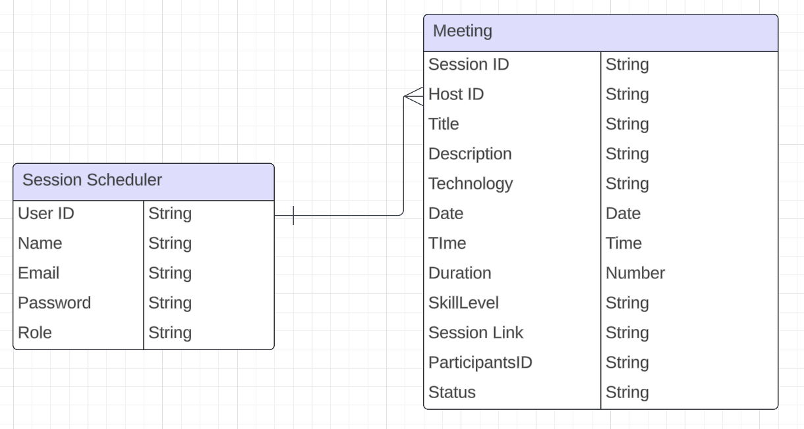

# Description

- **App Name:** CollabCoders
- **Description:** An app where developers dock to collaborate, learn, and elevate their coding skills through peer programming sessions.
- **Github URL:** https://github.com/amritadutta25/CollabCoders_backend
- **Deployed Website:** 

## User Stories

- Users should be able to see the site on desktop and mobile
- Users can create an account
- Users can sign in to their account
- Users can create a new peer programming session
- Users can see all peer programming sessions scheduled
- Users can update a peer programming session
- Users can delete a peer programming session

## Route Map

### Session routes:
| Route Name | Endpoint | Method | Description |
|------------|----------|--------|-------------|
| Index | /sessions | GET | Renders all sessions on a page|
| Delete | /sessions/:id | DELETE | Deletes a session from database|
| Update | /sessions/:id | PUT | Updates existing session|
| Create | /sessions | POST | Creates a new session|
| Show | /sessions/:id | GET | Renders a session on a page|

### User routes:
| Route Name | Endpoint | Method | Description |
|------------|----------|--------|-------------|
| Signup form | /user/signup | GET | Renders a form to register a new user |
| Signup | /user/signup | POST | Register a new user |
| Login form | /user/login | GET | Renders a form to login existing user |
| Login | /user/login | POST | Login an existing user |

## Design Mockups (Desktop + Mobile)

##### Mobile Design

![Mobile Design Mockup]
![Mobile Design Mockup]
![Mobile Design Mockup]

##### Desktop Design

![Desktop Design Mockup]
![Desktop Design Mockup]

## ERD (Entity Relationship Diagram)

## Model Fields

### User Model Fields

| Field Name | Description |
|------------|----------|
| User ID | Unique identifier for session scheduler (Primary Key) |
| Name | Session scheduler name |
| Email | User acount Email ID |
| Password | User account password |
| Role | Job Title |

### Session Model Fields

| Field Name | Description |
|------------|----------|
| Session ID | Unique identifier for each session (Primary Key) |
| Host ID | Identifier for the user hosting the session (Foreign Key) |
| Title | A brief title for the session, indicating the focus or project |
| Description | Detailed information about what the session will cover |
| Technology | The programming language or framework that will be used during the session |
| DateTime | The scheduled date and time for the session |
| Duration | Expected duration of the session |
| Skill Level | Intended skill level of participants (Beginner, Intermediate, Advanced) |
| Session Link | Virtual Meeting Invite Link |
| Participants ID | List of identifiers for users who plan to join the session |
| Status | Indicates whether the session is Open for joining, Full, or Completed |

## Beyond MVP